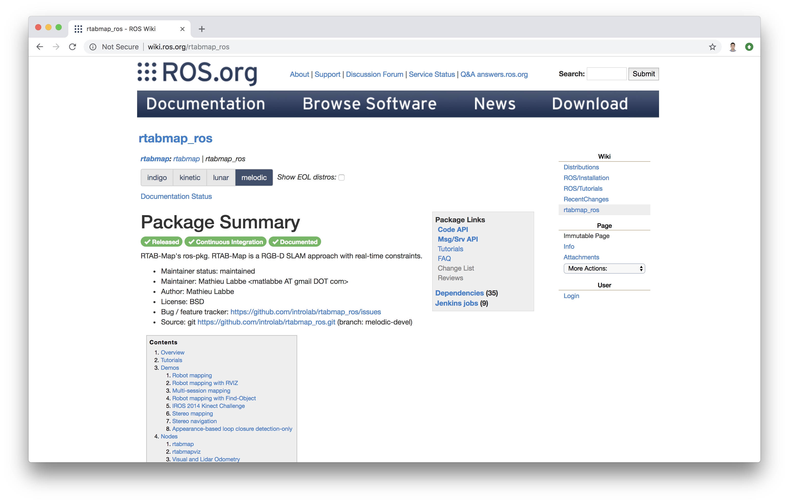
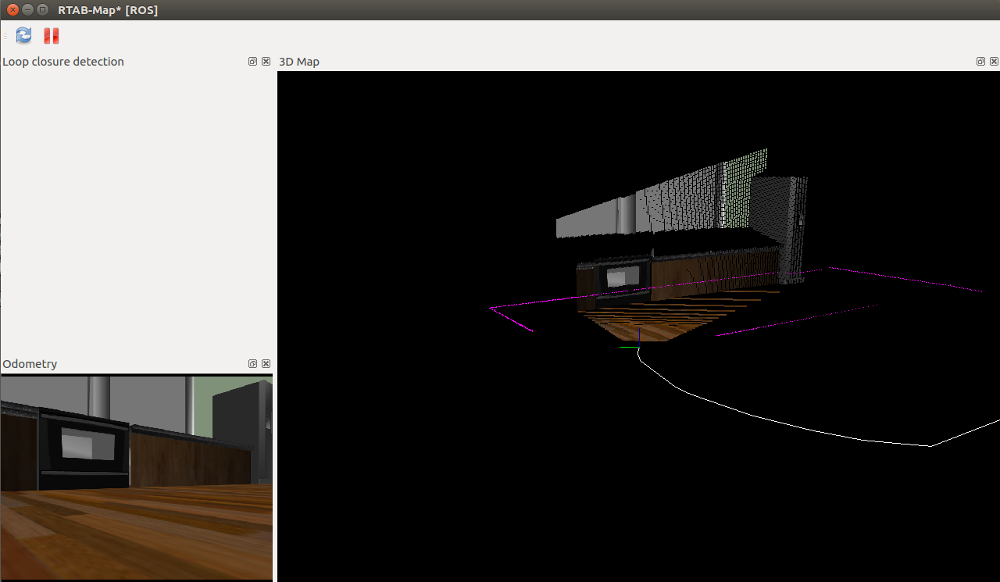
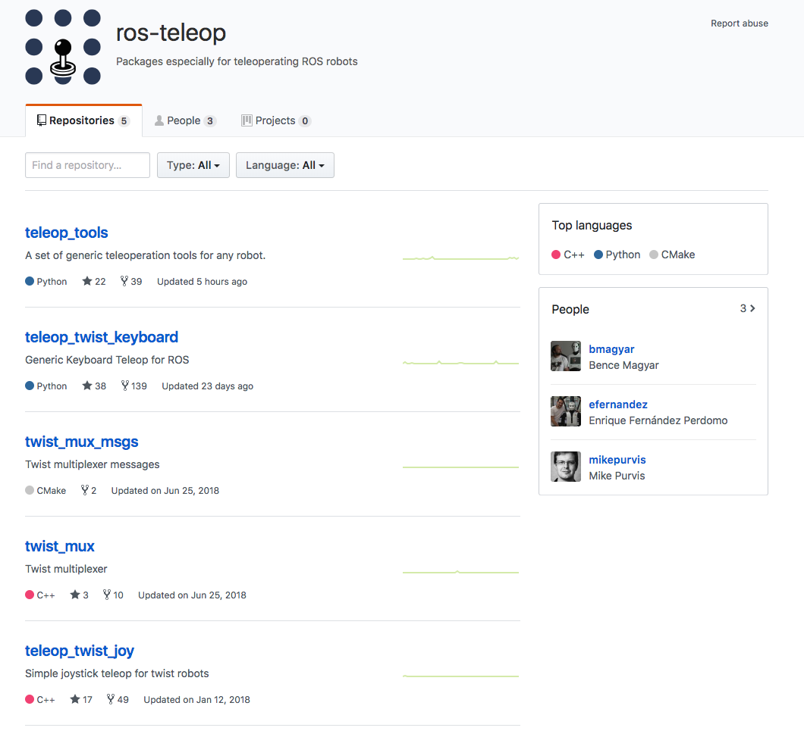
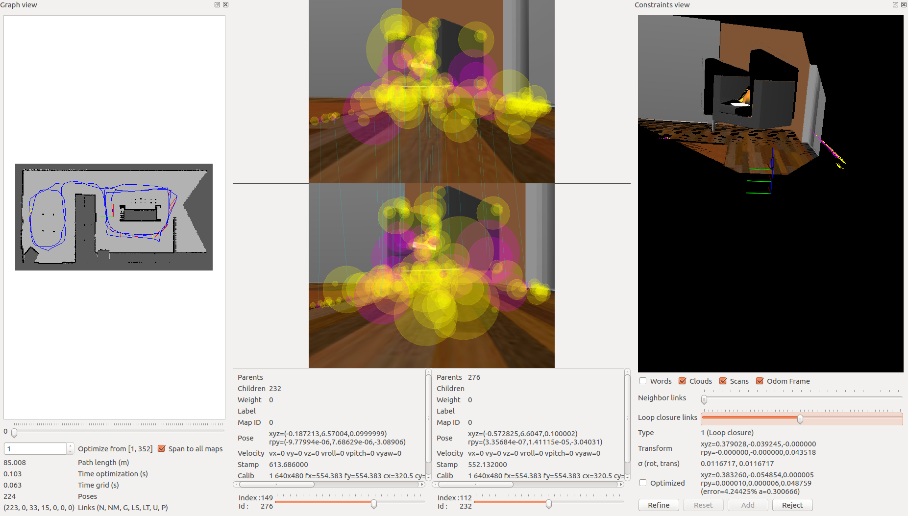
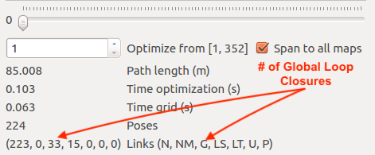

# Map My World
SLAM operation on a mobile robot using rtap_map ROS package 

### Github Repsitory Link
https://github.com/cynepton/mapmyworld

## Working with this project
### Requirements
- ROS (It comes with Gazebo installed)
  - For Ubuntu 16.04, install [ROS Kinetic Kame](http://wiki.ros.org/kinetic/Installation/Ubuntu)
  - For Ubuntu 18.04, install [ROS Melodic Morenia](http://wiki.ros.org/melodic/Installation)


1. Clone the repository:
    ```
    git clone -b master https://github.com/cynepton/mapmyworld.git
    ```
2. Navigate to the `catkin_mapmyworld` folder and run:
    ```
    catkin_make
    ```

## Project Creation Process

## Overview

Welcome to Map My World! In this project I created a 2D occupancy grid and 3D octomap from a simulated environment using your own robot with the RTAB-Map package.
This documentation follows the steps taken to acheive the project results. The same robot used in the [localization project](https://github.com/cynepton/where-am-i) is used.

RTAB-Map (Real-Time Appearance-Based Mapping) is a popular solution for SLAM to develop robots that can map environments in 3D. RTAB-Map has good speed and memory management, and it provides custom developed tools for information analysis. Most importantly, the quality of the documentation on [ROS Wiki](http://wiki.ros.org/rtabmap_ros) is very high. Being able to leverage RTAB-Map with your own robots will lead to a solid foundation for mapping and localization well beyond this Nanodegree program.

For this project we will be using the `rtabmap_ros` package, which is a ROS wrapper (API) for interacting with RTAB-Map. Keep this in mind when looking at the relative documentation.

#### The project flow will be as follows:

1. You will develop your own package to interface with the rtabmap_ros package.

2. You will build upon the localization project to make the necessary changes to interface the robot with RTAB-Map. An example of this is the addition of an RGB-D camera.

3. You will ensure that all files are in the appropriate places, all links are properly connected, naming is properly setup and topics are correctly mapped. Furthermore you will need to generate the appropriate launch files to launch the robot and map its surrounding environment.

4. When the robot is launched you will teleop around the room to generate a proper map of the environment.

## Simulation Setup 

Setup your `catkin_ws` (the folder name is arbitrary) folder as well as the src folder, then we need to grab the code from last project. Again, you could do that in two ways.

#### Method 1: `git`
If you have pushed the localization project to GitHub, go ahead and create a new repository then duplicate the code from last project to it.
```
git clone --bare https://github.com/exampleuser/old-repository.git

cd old-repository.git
git push --mirror https://github.com/exampleuser/new-repository.git

cd ..
rm -rf old-repository.git
```
Source: [https://help.github.com/articles/duplicating-a-repository/](https://help.github.com/articles/duplicating-a-repository/)

#### Method 2: Folder Upload
Simply add the folder to the src directory of the catkin workspace

### Verify Your Simulation Setup
Do a quick `catkin_make` and source the `devel/setup.bash` script. Launch the world to verify if the system is good to go!
```
roslaunch <YOUR PACKAGE NAME> world.launch
```

## RTAB-Map Pacakge
Although ROS provides you with huge amount of packages, integrating a ROS package requires your understanding of the package itself and how it connects to the project. The best place to start is on the [RTAB-Map ROS Wiki page](http://wiki.ros.org/rtabmap_ros).



According to the [documentation](http://wiki.ros.org/rtabmap_ros/Tutorials/SetupOnYourRobot), the recommended robot configuration requires:

- A 2D Laser, providing `sensor_msgs/LaserScan` messages
- Odometry sensors, providing `nav_msgs/Odometry` messages
- 3D Camera, compatible with `openni_launch`, `openni2_launch` or `freenect_launch` ROS packages

We need to setup the 3D camera sensor!

## Sensor Upgrade
In the previous projects I have been using an RGB camera; now it's time to give the robot an upgrade. Specifically, we will use a simulated Kinect camera for RTAB-Map.

### Add optical camera link
For RGB-D camera in URDF file, we need to add an extra link and an extra joint to the camera link in order to align the camera image in Gazebo properly with the robot. Note that the parent link of `camera_optical_joint` should be properly configured to the original camera link.

Add the following joint and link to the robot's `.xacro` file:

```
  <joint name="camera_optical_joint" type="fixed">
    <origin xyz="0 0 0" rpy="-1.5707 0 -1.5707"/>
    <parent link="camera_link"/>
    <child link="camera_link_optical"/>
  </joint>

  <link name="camera_link_optical">
  </link>
  ```

### Configuring the RGB-D Camera
To do this we will need to replace the existing camera and its shared object file: 
`libgazebo_ros_camera.so` to that of the Kinect shared object file:
`libgazebo_ros_openni_kinect.so`. Also, update the `<frameName>` to be the `camera_link_optical` link you created just now.

On top of this, additional parameters need to be set for the RGB-D camera as well as matching the topics published by the drivers of its real world counterpart. We have provided an example for the camera code below. Substitute that in the robot's `.gazebo` file!

A snippet of camera code is provided below:
```
<!-- RGBD Camera -->
  <gazebo reference="camera_link">
    <sensor type="depth" name="camera1">
        <always_on>1</always_on>
        <update_rate>20.0</update_rate>
        <visualize>true</visualize>             
        <camera>
            <horizontal_fov>1.047</horizontal_fov>  
            <image>
                <width>640</width>
                <height>480</height>
                <format>R8G8B8</format>
            </image>
            <depth_camera>

            </depth_camera>
            <clip>
                <near>0.1</near>
                <far>20</far>
            </clip>
        </camera>
         <plugin name="camera_controller" filename="libgazebo_ros_openni_kinect.so">
            <alwaysOn>true</alwaysOn>
            <updateRate>10.0</updateRate>
            <cameraName>camera</cameraName>
            <frameName>camera_link_optical</frameName>                   
            <imageTopicName>rgb/image_raw</imageTopicName>
            <depthImageTopicName>depth/image_raw</depthImageTopicName>
            <pointCloudTopicName>depth/points</pointCloudTopicName>
            <cameraInfoTopicName>rgb/camera_info</cameraInfoTopicName>              
            <depthImageCameraInfoTopicName>depth/camera_info</depthImageCameraInfoTopicName>            
            <pointCloudCutoff>0.4</pointCloudCutoff>                
                <hackBaseline>0.07</hackBaseline>
                <distortionK1>0.0</distortionK1>
                <distortionK2>0.0</distortionK2>
                <distortionK3>0.0</distortionK3>
                <distortionT1>0.0</distortionT1>
                <distortionT2>0.0</distortionT2>
            <CxPrime>0.0</CxPrime>
            <Cx>0.0</Cx>
            <Cy>0.0</Cy>
            <focalLength>0.0</focalLength>
            </plugin>
    </sensor>
  </gazebo>
  ```

## Launch File
We have the `launch` file to launch Gazebo and Rviz. Now, similar to what we did to create the `amcl.launch` in last project, we need to add the `launch` file for RTAB-Map!

#### `mapping.launch`
Our mapping launch file acts as the main node that interfaces with all the required parts to be able to perform SLAM with `RTAB-Map`. A labeled template for the `mapping.launch` file has been provided below. Create `mapping.launch` file in the `launch` folder.

Read through the code and the comments to understand what each part is accomplishing and why. Feel free to reach beyond this template with the documentation of RTAB-Map. You task here is to assign the correct topic to be remapped to the topics required by `rtabmap`.

- `scan`
- `rgb/image`
- `depth/image`
- `rgb/camera_info`

You should find the actual topics that the robot is publishing to, in the robot's `urdf` file. When you find the correct ones, substitute them in the `<arg>` tags at the beginning of this launch file. Then your mapping node could find all required information to perform RTAB-Mapping!

**Important: Change the `robot_footprint` value to whatever your robot footprint name is**

```
<?xml version="1.0" encoding="UTF-8"?>

<launch>
  <!-- Arguments for launch file with defaults provided -->
  <arg name="database_path"     default="rtabmap.db"/>
  <arg name="rgb_topic"   default="/camera/rgb/image_raw"/>
  <arg name="depth_topic" default="/camera/depth/image_raw"/>
  <arg name="camera_info_topic" default="/camera/rgb/camera_info"/>  


  <!-- Mapping Node -->
  <group ns="rtabmap">
    <node name="rtabmap" pkg="rtabmap_ros" type="rtabmap" output="screen" args="--delete_db_on_start">

      <!-- Basic RTAB-Map Parameters -->
      <param name="database_path"       type="string" value="$(arg database_path)"/>
      <param name="frame_id"            type="string" value="robot_footprint"/>
      <param name="odom_frame_id"       type="string" value="odom"/>
      <param name="subscribe_depth"     type="bool"   value="true"/>
      <param name="subscribe_scan"      type="bool"   value="true"/>

      <!-- RTAB-Map Inputs -->
      <remap from="scan" to="/scan"/>
      <remap from="rgb/image" to="$(arg rgb_topic)"/>
      <remap from="depth/image" to="$(arg depth_topic)"/>
      <remap from="rgb/camera_info" to="$(arg camera_info_topic)"/>

      <!-- RTAB-Map Output -->
      <remap from="grid_map" to="/map"/>

      <!-- Rate (Hz) at which new nodes are added to map -->
      <param name="Rtabmap/DetectionRate" type="string" value="1"/>

      <!-- 2D SLAM -->
      <param name="Reg/Force3DoF" type="string" value="true"/>

      <!-- Loop Closure Detection -->
      <!-- 0=SURF 1=SIFT 2=ORB 3=FAST/FREAK 4=FAST/BRIEF 5=GFTT/FREAK 6=GFTT/BRIEF 7=BRISK 8=GFTT/ORB 9=KAZE -->
      <param name="Kp/DetectorStrategy" type="string" value="0"/>

      <!-- Maximum visual words per image (bag-of-words) -->
      <param name="Kp/MaxFeatures" type="string" value="400"/>

      <!-- Used to extract more or less SURF features -->
      <param name="SURF/HessianThreshold" type="string" value="100"/>

      <!-- Loop Closure Constraint -->
      <!-- 0=Visual, 1=ICP (1 requires scan)-->
      <param name="Reg/Strategy" type="string" value="0"/>

      <!-- Minimum visual inliers to accept loop closure -->
      <param name="Vis/MinInliers" type="string" value="15"/>

      <!-- Set to false to avoid saving data when robot is not moving -->
      <param name="Mem/NotLinkedNodesKept" type="string" value="false"/>
    </node>
  </group>
</launch>
```

### Further Resources:
- [RTAB-Map Parameter Tutorial](http://wiki.ros.org/rtabmap_ros/Tutorials/Advanced%20Parameter%20Tuning)
- [List of RTAB-Map Parameters](https://github.com/introlab/rtabmap/blob/master/corelib/include/rtabmap/core/Parameters.h)

## RTAB-Map Real Time Visualization

#### Real Time Visulization
Another tool that you can use is rtabmapviz, which is an additional node for real time visualization of feature mapping, loop closures, and more. It’s not recommended to use this tool while mapping in simulation due to the computing overhead. rtabmapviz is great to deploy on a real robot during live mapping to ensure that you are getting the necessary features to complete loop closures.



If you would like to enable it for mapping, add this code snippet to the `mapping.launch file`. This will launch the `rtabmapviz` GUI and provide you with realtime feature detection, loop closures, and other relevant information to the mapping process.

**Important: Change the `robot_footprint` value to whatever your robot footprint name is**

```
<!-- visualization with rtabmapviz -->
    <node pkg="rtabmap_ros" type="rtabmapviz" name="rtabmapviz" args="-d $(find rtabmap_ros)/launch/config/rgbd_gui.ini" output="screen">
        <param name="subscribe_depth"             type="bool" value="true"/>
        <param name="subscribe_scan"              type="bool" value="true"/>
        <param name="frame_id"                    type="string" value="robot_footprint"/>

        <remap from="rgb/image"       to="$(arg rgb_topic)"/>
        <remap from="depth/image"     to="$(arg depth_topic)"/>
        <remap from="rgb/camera_info" to="$(arg camera_info_topic)"/>
        <remap from="scan"            to="/scan"/>
    </node>
```
    

## ROS Teleop Package

You have used `teleop` node to control your robot by keyboard strokes in previous labs and projects. Here, we also need it so that we could navigate the robot in the environment and perform RTAB-Mapping.

Clone the `teleop` package to your Workspace `src` folder and complile! You could find the code [here](https://github.com/ros-teleop/teleop_twist_keyboard)



## Map My World!
We have everything ready to go. Launch the ROS nodes and let us start mapping.

First, launch the Gazebo world and RViz, spawn the robot in the environment:
```
roslaunch <YOUR PACKAGE NAME> world.launch
```
Then, launch the `teleop` node:
```
rosrun teleop_twist_keyboard teleop_twist_keyboard.py
```
Finally, launch your mapping node:
```
roslaunch <YOUR PACKAGE NAME> mapping.launch
```

Navigate your robot in the simulation to create map for the environment! When you are all set, terminal the node and you could find your map `db` file in the place you specified in the `launch` file. If you did not modify the argument, it will be located in the `/root/.ros/` folder.

### Best Practices
You could start by lower velocity. Our goal is to create a great map with the least amount of passes as possible. Getting 3 loop closures will be sufficient for mapping the entire environment. You can maximize your loop closures by going over similar paths two or three times. This allows for the maximization of feature detection, facilitating faster loop closures! When you are done mapping, be sure to copy or move your database before moving on to map a new environment. Remember, relaunching the mapping node deletes any database in place on launch start up!

## Database Analysis
The `rtabmap-databaseViewer` is a great tool for exploring your database when you are done generating it. It is isolated from ROS and allows for complete analysis of your mapping session.

This is how you will check for loop closures, generate 3D maps for viewing, extract images, check feature mapping rich zones, and much more!



Let’s start by opening our mapping database:

We can do this like so: `rtabmap-databaseViewer ~/.ros/rtabmap.db`

Once open, we will need to add some windows to get a better view of the relevant information, so:

- Say yes to using the database parameters
- View -> Constraint View
- View -> Graph View

Those options are enough to start, as there are many features built into the database viewer!

Let’s talk about what you are seeing in the above image. On the left, you have your 2D grid map in all of its updated iterations and the path of your robot. In the middle you have different images from the mapping process. Here you can scrub through images to see all of the features from your detection algorithm. These features are in yellow. Then, what is the pink, you may ask? The pink indicates where two images have features in common and this information is being used to create neighboring links and loop closures! Finally, on the right you can see the constraint view. This is where you can identify where and how the neighboring links and loop closures were created.



You can see the number of loop closures in the bottom left. The codes stand for the following: Neighbor, Neighbor Merged, Global Loop closure, Local loop closure by space, Local loop closure by time, User loop closure, and Prior link.

When it comes time to design your own environment, this tool can be a good resource for checking if the environment is feature-rich enough to make global loop closures. A good environment has many features that can be associated in order to achieve loop closures.


## Optional: RTAB-Map Localization
If you desire to perform localization using the map you created, there are only a few changes you need to make. You can start by duplicating your `mapping.launch` file and renaming the duplicated file to `localization.launch`.

The following changes also need to be made to the `localization.launch` file:

- Remove the `args="--delete_db_on_start"` from your node launcher since you will need your database to localize too.

- Remove the `Mem/NotLinkedNodesKept` parameter

- Add the `Mem/IncrementalMemory` parameter of type `string` and set it to `false` to finalize the changes needed to put the robot into localization mode.

This is another method for localization you can keep in mind when working on your next robotics project!